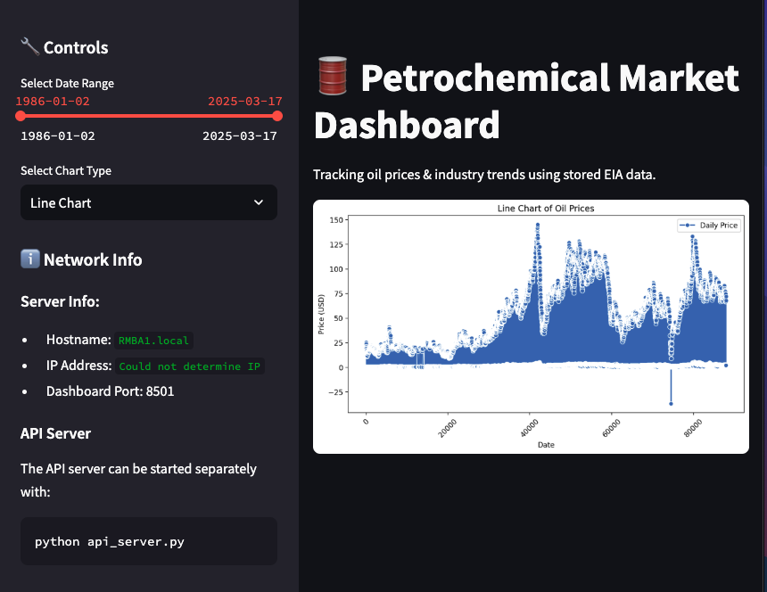

# petrochem-dashboard

Live site: [http://165.1.68.109:8501/](http://165.1.68.109:8501/)

This endeavor began after responding to a job vacancy for a Junior Market Reporter in Petrochemicals–a position based around collecting and analyzing trade data to provide daily market assessments for US polyolefins. Because of my background in both Natural Resources (Master of Science, 2010) and web development (over a decade of profession in Seattle’s technology environment) I decided to build a full-stack data pipeline so that users could interact with actual energy data.

First, I visited the US Energy Information Administration (EIA) to see what data was available, and what would be good for this project. In addition to providing a front-end graphical user interface for people to interact with the EIA also provides an API (Application Programming Interface) to access their data through the backend, which is perfect for building a data pipeline. I registered for an API key to my personal email address as a US Citizen, and got to work.

I began to build a data extractor script in Python using the API key provided. Some of the early errors I ran into were requesting too much information in too short a time, and not being able to store it logically–so I broke down the data structure we were pulling from, and deposited records into appropriate JSON archives; I also broke up the requests into “chunks” for smaller pings to the EIA database (db), to not overwhelm the system and also extract full 100% of the records.

After building the extraction process to acquire and store EIA data, I went to work building the frontend that could incorporate this data. Even through I’ve been primarily a JavaScript and Java developer, I’ve always used Python for various things at work, but this time wanted to build as much of the project as possible in Python.

I began local development with a virtual Python environment, to allow me to build quickly and test my creations–I eventually used several libraries to build a basic frontend that displayed various charts and graphs based off of oil prices (going back decades, as early as the EIA’s data begins). I eventually used a variety of modules (including streamlit) to build and run a local app built off the db we had built through the EIA API. Now came time to host the app.

I decided to use Oracle since they have a free cloud instance, and I knew it could handle the server responses necessary for this and future more built-out versions of this app. I spent time configuring Oracle’s backend instances and security lists, to not only allocate compute and storage space but also directly control the security features of which ports would be used.

While transferring development from my local computer to this online Virtual Machine (VM), I ran into several issues and had to write tests in Python with API endpoints I could test via Postman on my local machine, to finally enable a full clean path for the app to exist as a process on my Oracle instance, and be accessible via a public URL–after a few days, the app works!

Currently, the streamlit app is run as a process in my Oracle instance, but I'd like to better manage how that is executed: I experiemnted with some systemd configurations to manage this (combined with some CRON jobs), but there may be restrictions/limitations from the Cloud that limit this as effectively as I would like--this is a priority, though, and whether separate packages are installed to manage this, or I brew a homemade solution, making sure the site has as near to 100% run-time as possible is my immediate concern.

After making sure the site is robust enough (and setting up alerts/pings so that I know when to intervene), after that my next steps on the frontend are to provide more news stories and content, imported from around the web.

After that, adding other features to make the site worth visiting frequently for reliable, updated, and relevant content is my priority.
